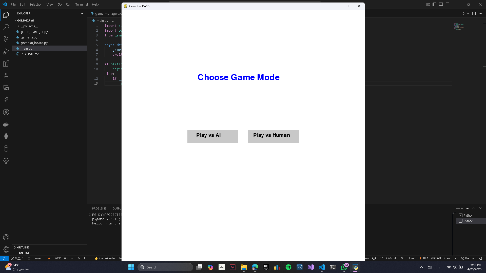
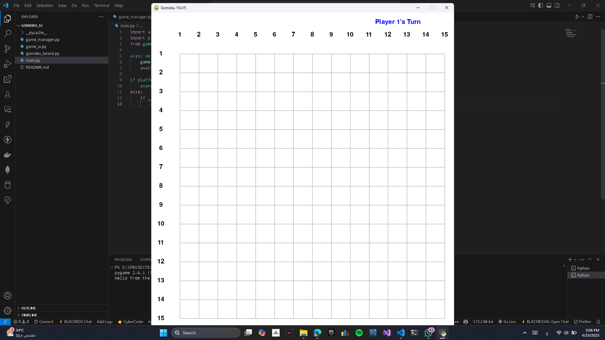
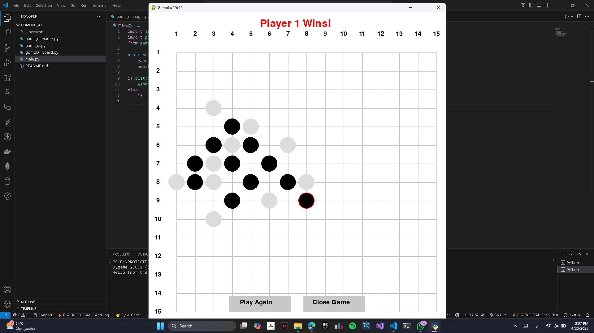

# 🧠 Gomoku AI Game (15x15 Board)

A Python-based Gomoku game with an AI opponent using the Minimax algorithm with Alpha-Beta pruning. Built with Pygame for a clean graphical interface and interactive gameplay.

---

## 📌 Project Overview

This project is a Gomoku game built with Python using a clean modular architecture:

- **`main.py`**: Entry point that starts the game.
- **`game_manager.py`**: Handles the game loop, player turns, and win condition checks.
- **`game_ui.py`**: Manages the graphical interface and interactions using `Tkinter`.
- **`gomoku_board.py`**: Implements the game logic, AI algorithm, and board operations.

---

## 🎮 Game Modes

- 🆚 Human vs Human
- 🤖 Human vs AI (Minimax algorithm with evaluation heuristics)

---

## 🧠 AI Features

- **Minimax Algorithm** with Alpha-Beta pruning.
- **Dynamic depth adjustment** based on game progress.
- **Move ordering** to prioritize central and strategic cells.
- Evaluation function that considers:
  - Threat levels
  - Open-ended sequences
  - Board positioning

---

## 🗂️ Folder Structure

```
Gomoku_ai/
│
├── main.py               # Entry point
├── game_manager.py       # Manages game state
├── game_ui.py            # Builds GUI and handles events
├── gomoku_board.py       # Game logic and AI engine
├── Screenshots/          # UI screenshots
├── README.md             # Project documentation
└── Gomoku_AI_Project_Report.pdf  # Original report
```

---

## 🚀 How to Run

1. Make sure you have **Python 3.9+** installed.
2. Install any missing dependencies (if any):
   ```bash
   pip install -r requirements.txt
   ```
   > This project mostly uses built-in libraries (like `tkinter`), so no extra installations should be needed.
3. Run the game:
   ```bash
   python main.py
   ```

---

## 👨‍💻 Team Members & Contributions

| Name            | GitHub         | Contribution                     |
| --------------- | -------------- | -------------------------------- |
| Mohamed Elsayed | @ELSEFI        | `gomoku_board.py,Project_Report` |
| Zeyad Ibrahim   | @ziad-ibrahim1 | `gomoku_board.py`                |
| Amr Elsayed     | @amrelsaid4    | `game_manager.py`                |
| Kareem hany     | @kareemhany111 | `game_manager.py`                |
| Mohamed Selsem  | @mohamed123-ui | `game_ui,Main.py,README.md`      |
| Mohamed Ahmed   | @mohamed333-ah | `game_manager.py`                |

---

## 📷 Screenshots





---

## 📄 License

This project is for academic and educational purposes.

## ❤️ Made with Python + Pygame

```
